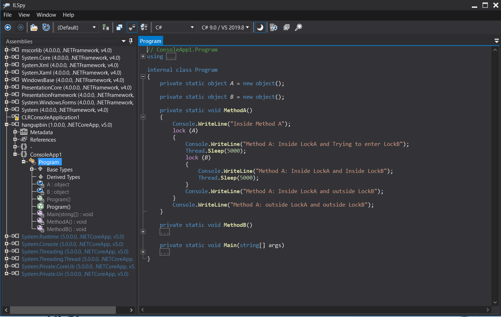

# Save Modules from dump

Can I get the DLL from the crash dump? Really?

## In what way?

### Save Module from SOS

```console
# スタック バックトレースの表示 (~*で全スレッド）"coreclr"を確認するのみ。
% 0:000> ~*k

...

# SOS拡張のロード
% 0:000> .load C:\Users\akira\.dotnet\sos\sos.dll

# コールスタックを表示(CLRStack) (~*eで全スレッド）
% 0:000> ~*e!clrstack

...

# 読み込まれたモジュールの一覧表示(lm)
% 0:000> lm

start             end                 module name
0000024f`5e160000 0000024f`5e168000   ConsoleApp1 C (pdb symbols)          C:\ProgramData\dbg\sym\ConsoleApp1.pdb\D29F1254055741EA80DB7F352A2F2D051\ConsoleApp1.pdb　
★dotnet buildの初期値は exe と dll と分離していて dll が本体のはず。
00007ff6`31f10000 00007ff6`31f35000   ConsoleApp1_exe C (private pdb symbols)  C:\ProgramData\dbg\sym\apphost.pdb\DABC283643E24A53A5AFB217E8A453241\apphost.pdb　
★こっちは ConsoleApp1.exe に rename された apphost.exe
00007ffb`bc2c0000 00007ffb`bcbb5000   System_Private_CoreLib   (pdb symbols)          C:\ProgramData\dbg\sym\System.Private.CoreLib.ni.pdb\128A4FE6B88722E942DEA7C82E3B2B841\System.Private.CoreLib.ni.pdb
00007ffb`c17b0000 00007ffb`c1cb0000   coreclr    (private pdb symbols)  C:\ProgramData\dbg\sym\coreclr.pdb\0976194BF8704D7FAA2EEBDC5EE8313D1\coreclr.pdb

...

00007ffc`178f0000 00007ffc`179ad000   kernel32   (pdb symbols)          C:\ProgramData\dbg\sym\kernel32.pdb\DC8E5EA7F9A96DEB5C882E99BD48CC7E1\kernel32.pdb
00007ffc`179f0000 00007ffc`17be5000   ntdll      (pdb symbols)          C:\ProgramData\dbg\sym\ntdll.pdb\1AEE50051B9801A042E4A92E9D14828D1\ntdll.pdb


# モジュールの出力（スタートアドレスと出力ファイル名を指定する）
% 0:000> !savemodule 0000024f`5e160000 C:\Dumps\hangupbin.dll
3 sections in file
section 0 - VA=2000, VASize=dd0, FileAddr=200, FileSize=e00
section 1 - VA=4000, VASize=564, FileAddr=1000, FileSize=600
section 2 - VA=6000, VASize=c, FileAddr=1600, FileSize=200

```

### View Saved Module



